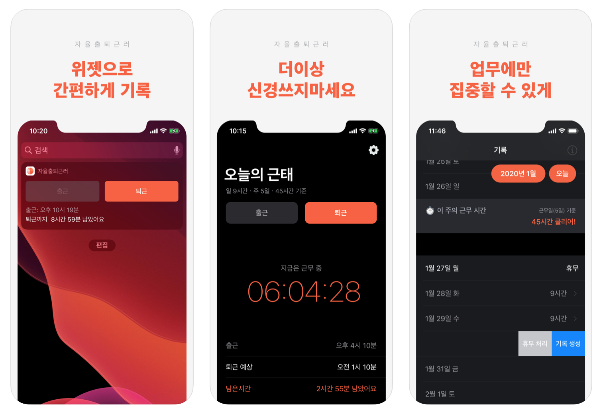

# 자율출퇴근러 (Flextimer)
⏲ 자율출퇴근러들을 위한 출퇴근시간관리앱 
🖥 AppStore: [https://apps.apple.com/kr/app/자율출퇴근러/id1484457501](https://apps.apple.com/kr/app/자율출퇴근러/id1484457501) 
🌳 gitRepository: [https://github.com/macaronpark/Flextimer](https://apps.apple.com/kr/app/자율출퇴근러/id1484457501) 

 

> 앱 '자율출퇴근러'는 자율출퇴근러들의 출퇴근 시간 관리를 도와줍니다.
> 출근도 바쁘게 업무도 바쁘게 퇴근도 바쁘게 하는 우리 직장인들을 대신해 
> 출퇴근 시간을 기록하고 상기 시켜 줄 '자율출퇴근러'로 직장생활 속 한 줌의 여유를 가지세요.

[주요 기능]
- 출퇴근 시간 기록, 조회(위젯 지원) 
- 근무 기록 생성, 수정 
- 근무일 휴무 처리 

** iOS 13 이상 버전을 지원합니다. 
** 다크 모드를 지원합니다. 
** 영어를 지원합니다.
